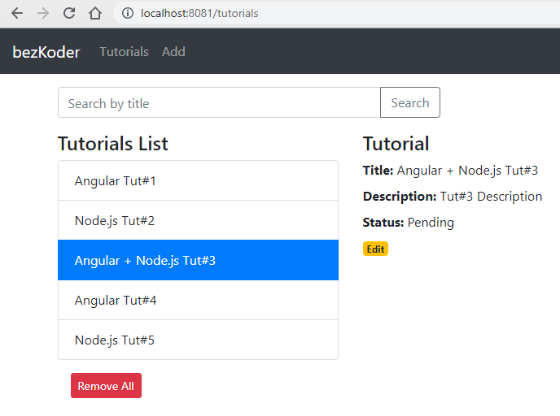

# Angular 11 Node.js MySQL CRUD example

In this tutorial, I will show you how to build a full-stack (Angular 11 + Node.js + Express + MySQL) example with a CRUD Application. The back-end server uses Node.js + Express for REST APIs, front-end side is an Angular App with HTTPClient.

We will build a full-stack Tutorial Application in that:
- Tutorial has id, title, description, published status.
- User can create, retrieve, update, delete Tutorials.
- There is a search box for finding Tutorials by title.



Tutorial link: [Angular 12 + Node.js Express + MySQL example](https://bezkoder.com/angular-12-node-js-express-mysql/)

For more detail, please visit:
> [Angular 12 CRUD Application example with Web API](https://bezkoder.com/angular-12-crud-app/)

> [Build Node.js Rest APIs with Express, Sequelize & MySQL](https://bezkoder.com/node-js-express-sequelize-mysql/)

> [How to integrate Angular 12 with Node.js Restful Services](https://bezkoder.com/integrate-angular-12-node-js/)

More Practice:
> [Angular 12 Pagination example | ngx-pagination](https://bezkoder.com/angular-12-pagination-ngx/)

> [Angular 12 JWT Authentication & Authorization with Web API](https://bezkoder.com/angular-12-jwt-auth/)

> [Angular 12 File upload example with progress bar & Bootstrap](https://bezkoder.com/angular-12-file-upload/)

> [Node.js Express File Upload Rest API example](https://bezkoder.com/node-js-express-file-upload/)

> [Server side Pagination in Node.js with Sequelize and MySQL](https://bezkoder.com/node-js-sequelize-pagination-mysql/)

> [Deploying/Hosting Node.js app on Heroku with MySQL database](https://bezkoder.com/deploy-node-js-app-heroku-cleardb-mysql/)

Security:
> [Angular 12 + Node.js Express: JWT Authentication and Authorization example](https://bezkoder.com/node-js-angular-12-jwt-auth/)

Associations:
> [Sequelize Associations: One-to-Many Relationship example](https://bezkoder.com/sequelize-associate-one-to-many/)

> [Sequelize Associations: Many-to-Many Relationship example](https://bezkoder.com/sequelize-associate-many-to-many/)

Fullstack with Node.js Express:
> [Angular 12 + Node.js Express + MySQL example](https://bezkoder.com/angular-12-node-js-express-mysql/)

> [Angular 12 + Node.js + Express + PostgreSQL example](https://bezkoder.com/angular-12-node-js-express-postgresql/)

> [Angular 12 + Node.js Express + MongoDB example](https://bezkoder.com/angular-12-mongodb-node-js-express/)

Serverless with Firebase:
> [Angular 12 Firebase CRUD with Realtime DataBase | AngularFireDatabase](https://bezkoder.com/angular-12-firebase-crud/)

> [Angular 12 Firestore CRUD example with AngularFireStore](https://bezkoder.com/angular-12-firestore-crud-angularfirestore/)

> [Angular 12 Firebase Storage: File Upload/Display/Delete example](https://bezkoder.com/angular-12-file-upload-firebase-storage/)

## Project setup

### Node.js Server
```
cd node-js-server
node server.js
```

### Angular Client
```
cd angular-11-client
```
Run `ng serve --port 8081` for a dev server. Navigate to `http://localhost:8081/`.