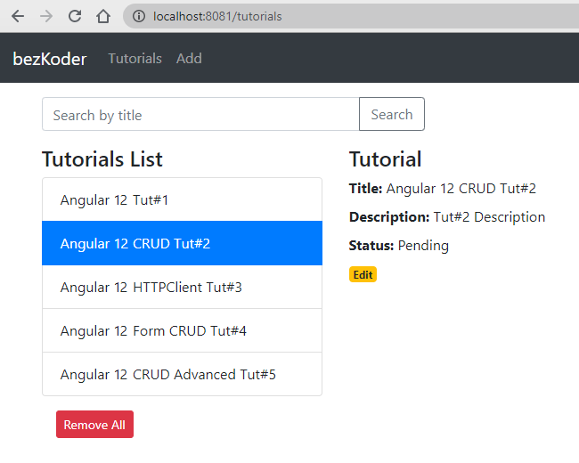

# Angular 12 CRUD application example with Web API

Build an Angular 12 CRUD Application to consume Web APIs, display, modify & search data.

Tutorial Application in that:
- Each Tutorial has id, title, description, published status.
- We can create, retrieve, update, delete Tutorials.
- There is a Search bar for finding Tutorials by title.

For instruction, please visit:
> [Angular 12 CRUD Application example with Web API](https://bezkoder.com/angular-12-crud/)

> [Angular 12 Pagination example | ngx-pagination](https://bezkoder.com/angular-12-pagination-ngx/)

> [Angular 12 JWT Authentication & Authorization with Web API](https://bezkoder.com/angular-12-jwt-auth/)

> [Angular 12 File upload example with progress bar & Bootstrap](https://bezkoder.com/angular-12-file-upload/)

> [Angular 12 Multiple Files upload example with Progress Bar](https://bezkoder.com/angular-12-multiple-file-upload/)

> [Angular 12 Form Validation example (Reactive Forms)](https://bezkoder.com/angular-12-form-validation/)

Fullstack with Node.js:

> [Angular 12 + Node.js Express + MySQL example](https://bezkoder.com/angular-12-node-js-express-mysql/)

> [Angular 12 + Node.js + Express + PostgreSQL example](https://bezkoder.com/angular-12-node-js-express-postgresql/)

> [Angular 12 + Node.js Express + MongoDB example](https://bezkoder.com/angular-12-mongodb-node-js-express/)

Fullstack with Spring Boot:

> [Angular 12 + Spring Boot + H2 Embedded Database example](https://bezkoder.com/angular-12-spring-boot-crud/)

> [Angular 12 + Spring Boot + MySQL example](https://bezkoder.com/angular-12-spring-boot-mysql/)

> [Angular 12 + Spring Boot + PostgreSQL example](https://bezkoder.com/angular-12-spring-boot-postgresql/)

> [Angular 12 + Spring Boot + MongoDB example](https://bezkoder.com/angular-12-spring-boot-mongodb/)

> [Angular 12 + Spring Boot: File upload example](https://bezkoder.com/angular-12-spring-boot-file-upload/)

Security:
> [Angular 12 + Spring Boot: JWT Authentication and Authorization example](https://bezkoder.com/angular-12-spring-boot-jwt-auth/)

> [Angular 12 + Node.js Express: JWT Authentication and Authorization example](https://bezkoder.com/node-js-angular-12-jwt-auth/)

Serverless with Firebase:
> [Angular 12 Firebase CRUD with Realtime DataBase | AngularFireDatabase](https://bezkoder.com/angular-12-firebase-crud/)

> [Angular 12 Firestore CRUD example with AngularFireStore](https://bezkoder.com/angular-12-firestore-crud-angularfirestore/)

> [Angular 12 Firebase Storage: File Upload/Display/Delete example](https://bezkoder.com/angular-12-file-upload-firebase-storage/)

Integration (run back-end & front-end on same server/port)
> [How to Integrate Angular with Node.js Restful Services](https://bezkoder.com/integrate-angular-10-node-js/)

> [How to Integrate Angular with Spring Boot Rest API](https://bezkoder.com/integrate-angular-12-spring-boot/)

## Development server

Run `ng serve --port 8081` for a dev server. Navigate to `http://localhost:8081/`. The app will automatically reload if you change any of the source files.

## Code scaffolding

Run `ng generate component component-name` to generate a new component. You can also use `ng generate directive|pipe|service|class|guard|interface|enum|module`.

## Build

Run `ng build` to build the project. The build artifacts will be stored in the `dist/` directory.

## Running unit tests

Run `ng test` to execute the unit tests via [Karma](https://karma-runner.github.io).

## Running end-to-end tests

Run `ng e2e` to execute the end-to-end tests via a platform of your choice. To use this command, you need to first add a package that implements end-to-end testing capabilities.

## Further help

To get more help on the Angular CLI use `ng help` or go check out the [Angular CLI Overview and Command Reference](https://angular.io/cli) page.
